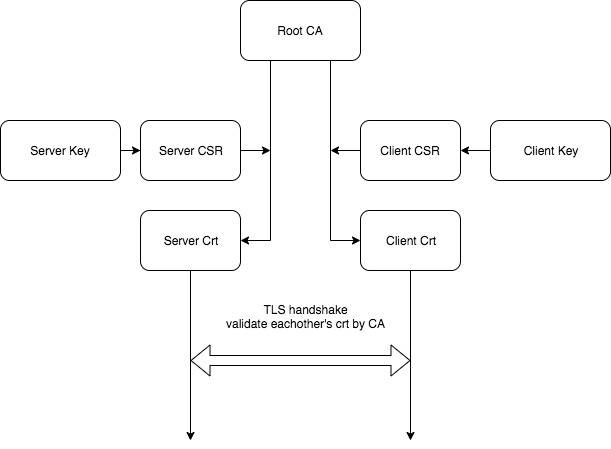

# go-mutual-tcp-tls

tcp with mutual tls


[中文介绍](https://blog.laisky.com/p/go-mutual-tls-tcp/)

## Run

```sh
# start server
go run server/server.go

# start client
go run client/client.go
```

## Prepare certs

* <https://medium.com/rahasak/tls-mutual-authentication-with-golang-and-nginx-937f0da22a0e>

Use same CA for client and server.



```sh
# 1. generate CA
openssl genrsa -des3 -out ca.key 4096
openssl req -new -x509 -days 365 -key ca.key -out ca.crt

# 2. generate server key & csr & crt
openssl genrsa -des3 -out server.key 1024
openssl rsa -in server.key -out server.key.text  # decrypt server key
# CN(common name) shoule be: localhost
openssl req -new -key server.key -out server.csr
openssl x509 -req -days 365 -in server.csr -CA ca.crt -CAkey ca.key -set_serial 01 -out server.crt

# 3. generate client key & csr & crt
openssl genrsa -des3 -out client.key 1024
openssl rsa -in client.key -out client.key.text  # decrypt client key
openssl req -new -key client.key -out client.csr
openssl x509 -req -days 365 -in client.csr -CA ca.crt -CAkey ca.key -set_serial 01 -out client.crt
```


